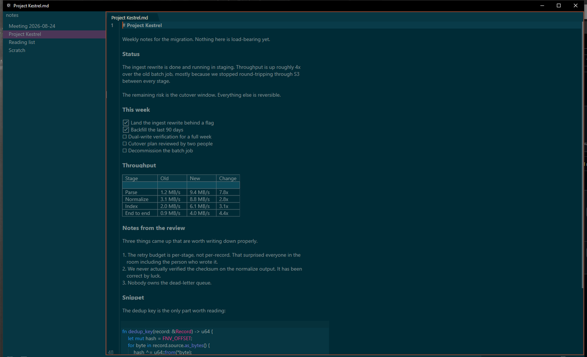
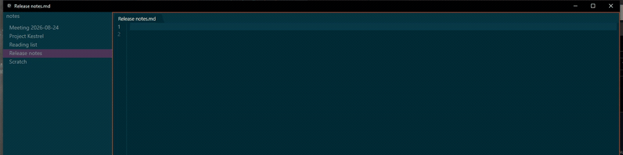
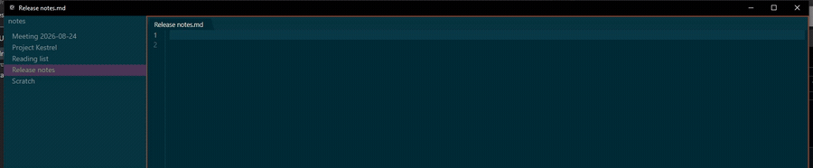
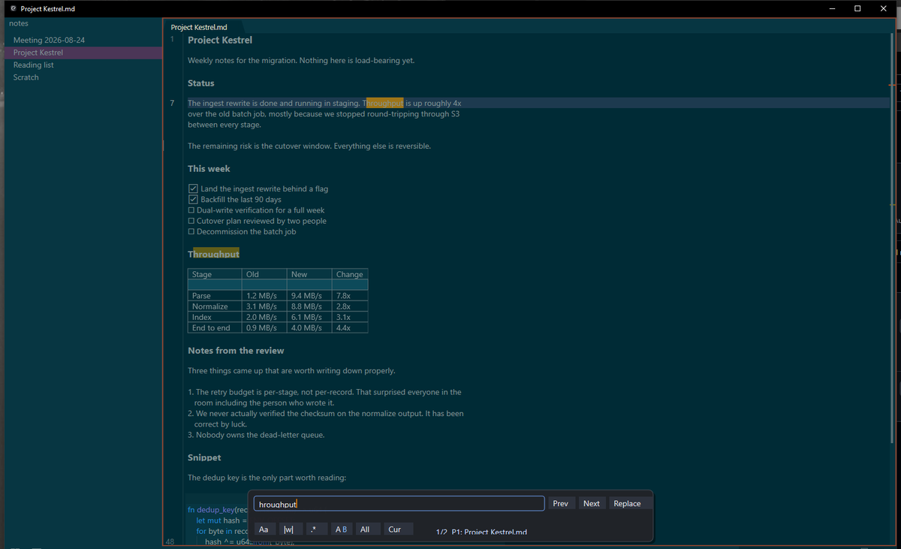

# Continuity

Continuity is a native Windows markdown notes editor for writing notes. Period. Code notes included, but this is not trying to be a code editor.

**[⬇ Download for Windows](https://github.com/jatoran/continuity/releases/latest)** - grab `continuity-<version>-setup.msi`. See [Downloads](#downloads) for the portable and standalone builds.



I wanted something with the speed, ephemerality, and safety I like in Sublime Text, but aimed at notes: better Windows virtual desktop behavior, WYSIWYG markdown editing, and no "did I save?" anxiety. Every keystroke is written to a local SQLite database; saving a file is export, not durability.

## Markdown renders as you type

The source stays plain markdown. The caret line always shows you the raw text, everything else renders.



## There is no save button

Every keystroke goes to a local SQLite database, so there is nothing to lose. Below, the process is hard-killed mid-sentence and reopened. The note, the caret position, and the open tab all come back.



The markdown surface is my own flavor of WYSIWYG. The source stays plain markdown, but Continuity projects it through a custom live renderer so headings, lists, checkboxes, links, tables, inline code, and images can feel integrated instead of bolted on.

It is built in Rust as a small Win32 app with DirectWrite/Direct2D rendering, rope-backed text, explicit worker threads, bounded caches, and SQLite WAL persistence. WYSIWYG adds performance pressure, so I benchmark and optimize the projection/rendering path to keep large notes responsive.

## Two things live in this repository

Continuity ships as two independent products built on one shared Rust editor engine.

| | What it is | Platform | Releases |
|---|---|---|---|
| **Continuity for Windows** | The native Win32 notes application. The end-user product. | Windows 10/11 | `v*` tags - [latest](https://github.com/jatoran/continuity/releases/latest), [all](https://github.com/jatoran/continuity/releases?q=tag%3Av&expanded=true) |
| **Continuity SDK** | An embeddable editor for your own app: Web Component + WASM, Rust, C, Python, and a native Win32 child control. | Browser, Electron, Windows, Linux, macOS | `sdk-v*` tags - [all](https://github.com/jatoran/continuity/releases?q=tag%3Asdk-v&expanded=true) |

They version separately and release separately, because they change at different rates and answer to different consumers. The desktop app is the one to download if you just want a notes editor. The SDK is the one to reach for if you want Continuity's editing behavior inside something you are building.

Both are early software and still changing quickly.

## Continuity for Windows

### Features

- Native Win32 editor for Windows 10 and Windows 11.
- Plain text and markdown source stays canonical.
- Live markdown rendering for headings, emphasis, lists, checkboxes, links, code blocks, tables, and inline images.
- Integrated markdown table editing with a more spreadsheet-like feel, so pipe tables can be worked with without constantly fighting raw markdown alignment.
- Note-friendly markdown niceties such as inline code handling and copyable code snippets.
- Every keystroke is durable to a local SQLite WAL database.
- Saving is export. The database is the truth.
- Multi-pane, multi-tab, multi-window session restore.
- Vaults: point Continuity at a folder and it autosaves every note in it, remembers the open tabs, and reconciles changes made outside the app.
- Portable mode that keeps settings, themes, keymap, notes, and backups beside the executable.
- Installed mode with Start Menu shortcut, optional desktop shortcut, uninstall support, and Windows Default Apps registration for markdown/text files.
- Configurable themes, keymap, settings, fonts, wrapping, and view behavior.
- Fast large-buffer projection and soft-wrap work aimed at keeping writing responsive.

### Find

Live match highlighting across the buffer, with regex, whole-word, case, and scope toggles.



### Performance notes

These are enforced in CI, not aspirational. A build that misses one fails the push.

| Gate | p99 budget |
|---|---:|
| Keypress to pixel | 8 ms |
| Edit application | 4 ms |
| `WM_PAINT` to frame ready | 2 ms |
| Incremental markdown parse | 1 ms |
| Cold start, empty | 120 ms |
| Stripped binary | 9 MiB |

There is also a heap assertion of zero new allocations per keystroke in steady state.

- Text input: `WM_CHAR` p99 around 2-4 ms in recent release traces.
- Edit application: p99 around 4 ms for normal typing/edit paths.
- Large-buffer row counts: roughly 10k-line soft-wrapped buffers cold-walk in about 50-55 ms in recent local traces.
- Rendering: viewport-first projection keeps large notes visible and editable while the full document index catches up.

### Install

```powershell
winget install Continuity.Continuity
```

winget installs the MSI, registers it with Add/Remove Programs, and picks up new versions through `winget upgrade`. The downloads below are the same builds for anyone who prefers a file.

### Downloads

GitHub Releases are the normal way to get builds without winget. Desktop releases are tagged `v<version>`.

[**releases/latest**](https://github.com/jatoran/continuity/releases/latest) always resolves to the newest desktop release, which is the link to use. Both products publish into one repository and the release list is strictly chronological, so SDK releases - which ship far more often - are interleaved with desktop ones. SDK releases never claim the "Latest" badge, so `releases/latest` cannot land you on one. To browse only desktop releases, filter the list with [`tag:v`](https://github.com/jatoran/continuity/releases?q=tag%3Av&expanded=true).

- `continuity-<version>-setup.msi`: recommended for normal use. Installs under Program Files and supports in-place upgrades.
- `continuity-<version>-portable.zip`: no-install build. Extract the folder and run `continuity.exe`; app data stays in that folder.
- `continuity-<version>-standalone.zip`: just `continuity.exe`; settings, themes, and notes use your normal Windows AppData.
- `SHA256SUMS.txt`: hashes for release assets.

Unsigned builds may trigger Windows SmartScreen until release signing is in place.

## Continuity SDK

The same editor engine, without the Windows application around it. One synchronous Rust core owns text, selections, undo, revisions, and markdown projection; each surface is a thin adapter over it. Embedding is storage-neutral: the SDK creates no database, no files, and no background workers, and your application stays in charge of persistence.

| Host | Use | Visual |
|---|---|---|
| Browser, Electron, or webview | `<continuity-editor>` Web Component | Yes |
| React, Svelte, Vue, Preact, vanilla | Framework adapters over the same WASM engine | Yes |
| JavaScript without UI | `Editor` facade | No |
| Rust | `continuity_engine::Engine` | No |
| Native Win32 Rust host | `continuity_ui::EditorControl` child HWND | Yes |
| Python | `continuity_editor.Editor` | No |
| C / C++ / any FFI host | `continuity_engine` C ABI | No |

```html
<script type="module">
  import { initialize } from "@continuity-editor/editor";
  import wasmUrl from "@continuity-editor/editor/wasm?url";

  await initialize({ wasm: wasmUrl });
</script>

<continuity-editor value="# Hello\n\nStart typing."></continuity-editor>
```

### Install

```bash
npm install @continuity-editor/editor@next   # browser, Electron, any JS host
cargo add continuity-engine                  # Rust
```

The `@next` on the npm package is required. The SDK is a preview channel, so it publishes to the `next` dist-tag and has no `latest`; a bare `npm install @continuity-editor/editor` will not resolve.

`pip install continuity-editor` is not available yet. The Python wheel is currently built for Windows only, and shipping it without wheels for other platforms would make `pip install` fail confusingly on Linux and macOS.

Every SDK artifact is also attached to its GitHub Release, if you would rather pin an exact file:

```powershell
gh release download sdk-v0.2.34 --repo jatoran/continuity --dir continuity-sdk
npm install ./continuity-sdk/continuity-editor-0.2.34.tgz
```

Each SDK release carries the npm tarball, the `continuity-text` / `continuity-buffer` / `continuity-engine` crates, a Windows C archive (DLL plus header), a Python wheel, a CycloneDX SBOM, `release-manifest.json`, and `SHA256SUMS.txt`, all covered by GitHub build provenance attestation.

The C ABI ships as a Windows DLL plus `continuity_engine.h` in the release archive; it is not on a package registry.

SDK releases never take the repository's "Latest" badge, which belongs to the desktop application; that holds on every channel. A `preview`-channel SDK release is additionally marked as a GitHub prerelease, which is a statement about maturity, not about which product is the headline.

Full integration contracts, per-surface APIs, supported targets, and version history: [EMBEDDING.md](EMBEDDING.md). Browser and framework examples: [`packages/editor/README.md`](packages/editor/README.md).

## Build

Requirements:

- Windows 10 or Windows 11
- Rust stable with the `x86_64-pc-windows-msvc` target
- Visual Studio Build Tools or another MSVC toolchain

Build the app:

```powershell
cargo build --release -p continuity-app
```

Build local desktop release artifacts:

```powershell
cargo xtask release --skip-sign
```

The MSI path also requires WiX v7:

```powershell
dotnet tool install --global wix --add-source https://api.nuget.org/v3/index.json
wix eula accept wix7
wix extension add --global WixToolset.UI.wixext/7.0.0
cargo xtask installer
```

Build and validate the SDK's browser artifact (requires the `wasm32-unknown-unknown` target and Node 22):

```powershell
cargo xtask browser-check
```

## License

See [LICENSE](LICENSE).
